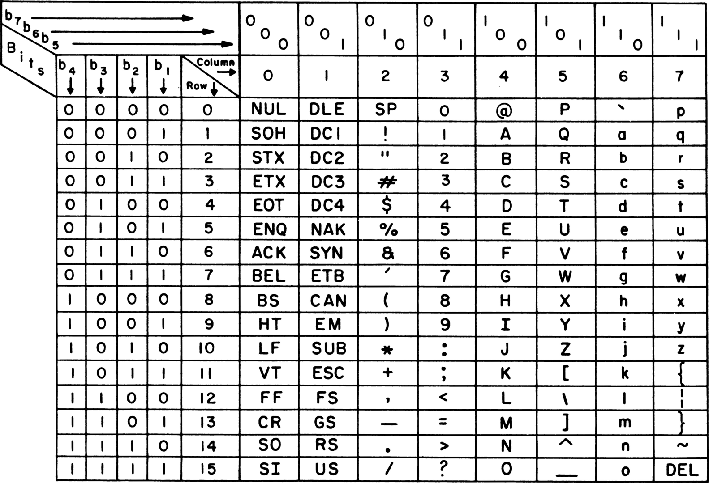

# EPFL CS-108

Course material / notes for EPFL CS-108, practice of object-oriented programming.

## Content
- Week 1: 
  - [UnitTests](/src/UnitTests) - Unit Test with JUnit
  - [Immutability](/src/Immutability)
- Week 2:
  - [Generics](/src/Generics)
- Week 3 and Week 4:
  - [Collections](/src/Collections)
- Week 5:
  - [Lambdas](/src/Lambdas)
  - [Streams](/src/Streams)
- Week 6:
  - [DesignPatterns](/src/DesignPatterns) - Design Patterns: Decorator, Adapter, Composite
- Week 8:
  - [DesignPatterns ⇒ Observers](/src/DesignPatterns/Observers) - Design Pattern: Observer / Subject
- Week 9:
  - [JavaFX](/src/JavaFX) - Graphical User Interfaces with [JavaFX](https://gluonhq.com/products/javafx/)
- Week 10:
  - [IntegralTypes](/src/IntegralTypes) - Integer representation and Bit manipulations
- Week 11:
  - [IO](/src/IO) - Input / Output with java.io

## Resources
Below is are some resources useful for these course notes.

### JavaFX Documentation
This is the entire documentation for OpenJFX version 22:  
[OpenJFX 22 Docs](https://openjfx.io/javadoc/22/index.html)

### ASCII Map
